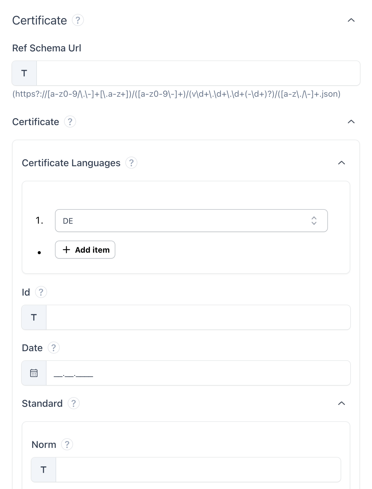

# JSON UI

A dynamic user interface for creating JSON documents according to a JSON schema.



## JSON UI decision tree
```
.
├── string
│   ├── file
│   │   └── file upload
│   │       ├── file type
│   │       └── size requirements
│   ├── enum
│   │   ├── dropdown (one of)
│   │   │   └── search functionality
│   │   ├── radio button
│   │   └── autocomplete
│   ├── date
│   │   └── date picker
│   │       ├── min / max date
│   │       └── time input
│   ├── password
│   │   └── password input
│   ├── color
│   │   └── color picker
│   ├── multiline
│   │   ├── textarea
│   │   │   └── min / max length
│   │   └── wysiwyg editor
│   │       └── ...
│   └── one line
│       └── text input
│           ├── min / max length
│           └── format / mask
│               ├── email
│               ├── password
│               ├── phone
│               ├── zip code
│               └── url
├── number
│   ├── enum
│   │   └── dropdown (single select)
│   ├── number picker
│   │   ├── min / max
│   │   ├── steps
│   │   ├── number format
│   │   └── decimal places
│   └── slider
│       ├── min / max
│       └── steps
├── boolean
│   ├── toggle
│   └── checkbox
├── object
│   └── section
│       ├── title
│       ├── level
│       └── collapsable
└── array
    ├── typed set (many of)
    │   ├── checkbox group
    │   └── multi select dropdown
    └── repeatable field group
        ├── min / max item count
        └── optional item type
``````